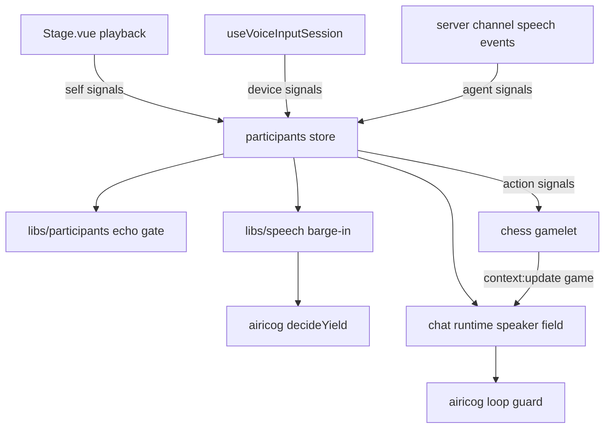

# Participants: the character hears herself apart from others

Status: proposed. Phase 1 is implemented behind `initiative.yieldWhenInterrupted`. Its done condition is not tested with real audio.

## Context

Neuro-sama-style behavior needs three things that AIRI cannot do today:

- **Barge-in.** A person talks over the character, and she stops.
- **AI-to-AI conversation.** The character talks with another AI agent, not only with the user.
- **Co-play.** The character plays a game with the user or with another AI agent.

All three need the same capability. The character must know which sound and which event come from her, and which come from someone else.

AIRI has no such capability now:

- The desktop app stops voice input while the character speaks (`apps/stage-tamagotchi/src/renderer/pages/index.vue:751`). This prevents self-transcription, but it also prevents barge-in.
- Voice detection reads only the microphone. It has no reference signal for the character's own output (`packages/stage-ui/src/libs/audio/vad.ts:63`).
- Chromium echo cancellation does not reliably remove Web Audio output. `Stage.vue` plays speech through an `AudioBufferSourceNode` (`packages/stage-ui/src/components/scenes/Stage.vue:372`).
- The chat runtime knows the speaker only from a text prefix such as `(From Discord user …)` (`packages/stage-ui/src/stores/mods/api/context-bridge.ts:696`). User turns have no speaker field.
- The protocol has no speech-playback events. Another stage cannot know when this character speaks.
- `decideYield` has no input for the source of the overlap (`packages/cognitive-airicog/src/initiative/yielding.ts:19`).

These parts already exist and are not connected:

- `createBargeInController` and `bindBargeInToPlaybackManager` (`packages/stage-ui/src/libs/speech/barge-in.ts:69`, `:182`).
- The decoded `AudioBuffer` of each played item, available in every playback `onStart` event (`packages/pipelines-audio/src/types.ts:52`).
- An `AnalyserNode` on the speech output that nothing reads (`Stage.vue:706`).
- Per-user voice streams in the Discord bot (`integrations/discord-bot/src/bots/discord/commands/summon.ts:245`).

## Decision

Introduce one model for every source the character perceives: the **participant**.

A participant has an id and a kind:

- `self`: the character's own output. There is exactly one `self` participant per stage.
- `other`: everything else. An `other` participant has an origin: `device` (a local microphone or input device), `agent` (another AI agent), or `remote-user` (a person on Discord or another channel).

Each participant publishes the same three signals:

- **Activity**: speech start and speech end, with a timestamp.
- **Utterance**: the text of what the participant said, when it is known.
- **Action**: a game move or other non-speech act, when the participant takes one.

### Self channel

The stage publishes the `self` participant from the playback manager. On each playback start it publishes:

- the activity signal,
- the utterance text (`PlaybackItem.text`),
- an energy envelope of the played `AudioBuffer`, in 10 ms frames.

This is an efference copy. The character knows what she said and when, without listening to it.

### Echo separation

The microphone participant uses the self channel to separate the character's echo from other speech. Phase 1 uses residual-energy gating:

1. Delay the self envelope by the measured output-to-input latency.
2. Scale it by an echo gain that the stage learns during single-talk (self active, no other speech).
3. Count microphone speech as `other` only when the microphone energy exceeds the predicted echo by a margin.

This is double-talk detection, not echo cancellation. It decides who is talking. It does not clean the audio for transcription. Transcription stays suppressed while the character speaks, as it is now.

A full acoustic echo canceller can replace the gate later, behind the same interface. Options include WebRTC loopback playback or a WASM echo canceller. Per AGENTS.md, the user selects the library before that work starts.

### Turn-taking

The barge-in controller subscribes only to `other` activity. `decideYield` gets one new input: the participant that overlaps. The policy is the same for every `other` participant. A card can make the character yield to people and not to agents, or the opposite.

Voice detection stays active during playback only when the active card turns it on. The default stays as it is now.

### Agent participants

A stage publishes its `self` signals to the server channel as new events:

- `output:speech:activity` (start and end, with the participant id),
- `output:speech:utterance` (text, with the participant id).

Another stage subscribes to them and creates an `other` participant with origin `agent`. Its utterances go into the chat runtime as user turns with a structured speaker field, not a text prefix. The Discord prefix moves to the same field.

Two agents can talk to each other without a person. Each one must have a loop guard. The initiative refractory gap already limits unprompted turns. A per-session turn budget limits replies.

### Co-play

A game is a shared environment, not a participant. The game publishes state, and each participant publishes actions into it. The character perceives:

- game state, through the existing `context:update` lane `game`,
- partner actions, as `action` signals from `other` participants,
- partner speech, through the same channels as conversation.

She acts through game tools, as the chess gamelet does now (`packages/plugin-sdk-tamagotchi/src/kits/gamelet/index.ts:68`). A partner can be the user (origin `device`) or another agent (origin `agent`). The game does not need to know which.

The first game is chess. It is turn-based, so it needs no low-latency action, and it already has a gamelet and a tool kit. A human partner and an agent partner use the same game state and the same move format.

## Ownership

- `packages/cognitive-airicog/src/initiative` owns the policy: `decideYield` with the overlap source, and the loop guard for agent conversation. It stays free of Vue and audio code.
- `packages/stage-ui/src/libs/participants` owns the pure parts: the participant types, the energy envelope, and the echo gate. These are new.
- A new unsynchronized Pinia store in `packages/stage-ui/src/stores/participants.ts` owns runtime state: the active participants and their activity. Each renderer has its own audio, so this state must not be synchronized across windows.
- `Stage.vue` owns the self channel, because it owns the playback manager.
- `useVoiceInputSession` owns the device participant, because it owns voice detection.
- `packages/plugin-protocol` owns the new speech events.
- The chess plugin owns the game state and the move tools.

## Phases

1. **Self channel and barge-in.** Self channel, envelope, echo gate, device participant, barge-in controller connected. Off by default. Done when a person can stop the character with speakers on, and the character does not stop herself during a 10-minute monologue.
2. **Agent participants.** Speech events in the protocol, agent participants, structured speaker field, loop guard. Done when two stages hold a conversation that stops within the turn budget.
3. **Co-play.** Chess with a human partner, then with an agent partner, through one game interface.

Each phase ships on its own and keeps the earlier default behavior unless a card turns the new behavior on.

## Non-goals

- No speaker diarization in one microphone stream. One device is one participant.
- No change to transcription quality during double-talk. Phase 1 decides who talks. It does not clean the audio.
- No in-browser model inference. That is a separate decision, deferred by the user.
- No new games other than chess in this record.

## Open questions

- **Echo canceller library.** The user selects one before an echo canceller replaces the phase 1 gate.
- **Chess plugin source.** This checkout has only `plugins/airi-plugin-game-chess/package.json`. Phase 3 needs the plugin source.
- **Agent identity.** Phase 2 assumes the other agent is another AIRI stage on the same server channel. External agents need an adapter that publishes the same two events.

## Module dependencies



## Affected files

```text
packages/cognitive-airicog/src/initiative/
  yielding.ts
  conversation-guard.ts            (new)
packages/stage-ui/src/
  libs/participants/               (new)
  stores/participants.ts           (new)
  libs/speech/barge-in.ts
  components/scenes/Stage.vue
  composables/audio/voice-input-session.ts
  stores/mods/api/context-bridge.ts
  types/airiCard.ts
packages/plugin-protocol/src/types/events.ts
packages/core-agent/src/runtime/chat-orchestrator-runtime.ts
apps/stage-tamagotchi/src/renderer/pages/index.vue
integrations/discord-bot/src/adapters/airi-adapter.ts
plugins/airi-plugin-game-chess/
```
